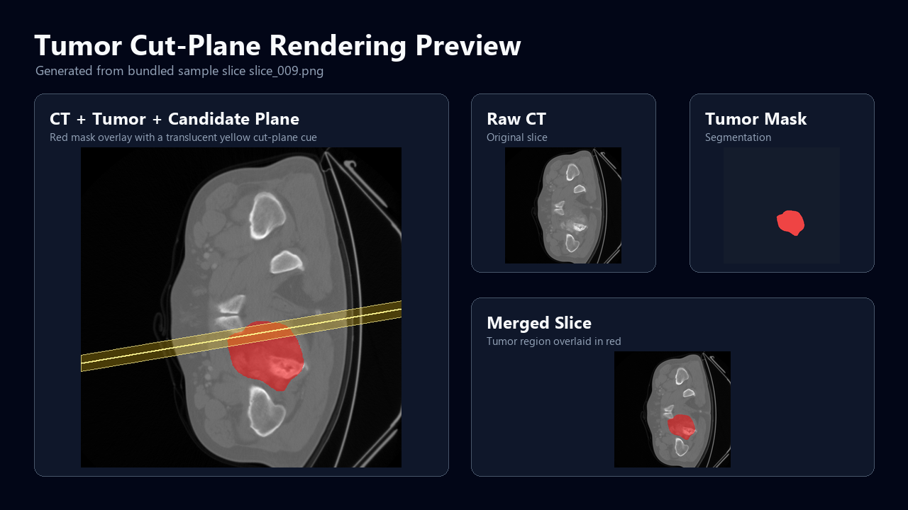

# Tumor Cut-Plane Show

An experimental visualization toolkit for bone tumor CT slices, tumor-mask overlays, STL convex hulls, and interactive cut-plane exploration with VTK.



The preview above is generated from the bundled PNG sample slices with:

```powershell
python render_preview.py
```

## QuickStart

1. Clone the repository and enter the project folder.

```powershell
git clone https://github.com/GGN-2015/tumor-cut-plane-show.git
cd tumor-cut-plane-show
```

2. Create and activate a virtual environment.

```powershell
python -m venv .venv
.\.venv\Scripts\Activate.ps1
```

3. Install dependencies.

```powershell
pip install -r requirements.txt
```

4. Regenerate the README rendering preview from the bundled sample slices.

```powershell
python render_preview.py
```

5. If you have STL models, generate the tumor convex hull and open the interactive cut-plane viewer.

```powershell
python convex_hull.py tumor.stl tumor_hull.stl
python show_all.py --hull tumor_hull.stl --stl output.stl --stl tumor.stl
```

Use the arrow keys in the VTK window to rotate the support vector and move the tangent cut plane.

## Data Layout

This repository includes PNG sample slices so the 2D overlay and README preview can run immediately:

- `CT/`: CT PNG slices.
- `SegmentationCT/`: segmentation-mask PNG slices.
- `merged/`: CT slices with the tumor mask overlaid in red.

Large medical source files are not included. Place them in the project root or pass explicit paths:

- `CT.nii`: source CT NIfTI volume.
- `SegmentationCT.nii`: source segmentation NIfTI volume.
- `output.stl`: bone STL model.
- `tumor.stl`: tumor STL model.
- `tumor_hull.stl`: generated convex-hull STL model.

## Scripts

| Script | Purpose |
| --- | --- |
| `nii_split.py` | Split `SegmentationCT.nii` into PNG slices under `SegmentationCT/`. |
| `nii_split2.py` | Split `CT.nii` into PNG slices under `CT/`. |
| `merge_image.py` | Overlay segmentation PNG slices on CT PNG slices and write `merged/`. |
| `render_preview.py` | Generate `docs/render-preview.png` from bundled sample PNG slices. |
| `convex_hull.py` | Generate `tumor_hull.stl` from `tumor.stl`. |
| `cut_plane.py` | Compute tangent planes for a convex-hull STL and support vector. |
| `show_plane.py` | Display a convex hull together with one or more translucent planes. |
| `vtk_show_tumor.py` | Display bone and tumor STL models in one VTK scene. |
| `show_all.py` | Display bone, tumor, and an interactive tangent cut plane in one scene. |
| `key_press_vtk.py` | Minimal VTK keyboard-control demo. |

## Common Commands

Split source NIfTI files:

```powershell
python nii_split2.py CT.nii --output CT
python nii_split.py SegmentationCT.nii --output SegmentationCT
```

Merge CT and segmentation slices:

```powershell
python merge_image.py --ct CT --segmentation SegmentationCT --output merged
```

Compute tangent planes for a custom support vector:

```powershell
python cut_plane.py tumor_hull.stl --normal 0.1,-0.5,1
```

Render custom static planes:

```powershell
python show_plane.py tumor_hull.stl --plane 4,104,120:0.87,0.22,0.44 --plane 55,143,95:0.09,-0.45,0.89
```

## Notes

- The default commands assume you run them from the repository root.
- The 3D VTK scripts require valid STL files and a desktop session with graphics support.
- `show_all.py` uses `tumor_hull.stl` to place the tangent plane and uses `output.stl` plus `tumor.stl` for the rendered bone/tumor context.
